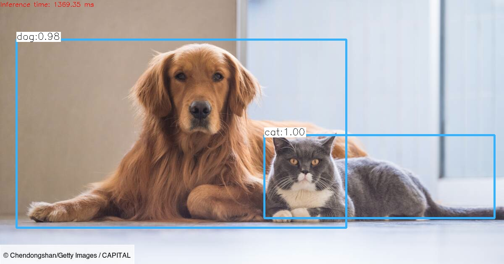

### Artificial Intelligence Project for Object and Animal Recognition

This project aims to develop an advanced artificial intelligence system capable of recognizing and identifying various objects and animals from images and videos. The main objective is to provide an accurate and robust solution for automatic recognition, which can have numerous practical applications.

By harnessing the power of technologies such as YOLOv3 and OpenCV, I have developed a robust and accurate system for recognizing and identifying objects and animals from images and videos.

I have followed a systematic approach, including data collection, preprocessing, model training, validation, and the creation of a user-friendly interface. By doing so, we have ensured the reliability and usability of my recognition system.


### Download the Models file

You have just to run the **getModels.sh** file from command line to download the Yolo needed models file

	sudo chmod a+x getModels.sh
	./getModels.sh


### Run the code

Command line usage for object detection using YOLO version 3 

* Python

  * Using CPU

    * A video file:
     ```bash
     python3 detect.py --video myvideo.mp4 --device 'cpu'
     ```
    * A single image:
    ```bash
    python3 detect.py --image cat_and_dog.jpg --device 'cpu'
    ```


  * Using GPU

    * A video file:
     ```bash
     python3 detect.py --video myvideo.mp4 --device 'gpu'
     ```
    * A single image:
    ```bash
    python3 detect.py --image cat_and_dog.jpg --device 'gpu'
    ```

### Results of programme after using an image

 

### Final Words
The potential applications of this technology are vast and varied, ranging from security and surveillance to robotics and agriculture. With the rapid advancements in machine learning and computer vision, our system has the ability to enhance decision-making processes, improve efficiency, and contribute to the development of innovative solutions.
